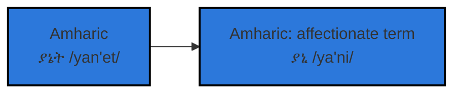

# Occi

## `updates`
- 👋 Hello. Hi. Welcome. I'm Edomiyas Wondwossen, but you can call me **Yani**
- ⚡️ I'm curretnly unpacking the clutter of conventional education by refactoring skills
- 🖥 Most recent project: NumPose
- 📫 email: edomiyaswond@gmail.com

***

### `functions`

    
    
    
    

***

### `objects`

    
    
    

***

<!--
### `class`
**Noun**: `yani`; **plural noun**: `yanetawi`
 
*an unprecedented desire to create through the continuous process of discovery*
 
 
**Origin**: childhood name

--->

<!---
EdomiyasGitHub/EdomiyasGitHub is a ✨ special ✨ repository because its `README.md` (this file) appears on your GitHub profile.
You can click the Preview link to take a look at your changes.
--->

