# Yani
**Noun**: `yani`; **plural noun**: `yanetawi`
 
*an unprecedented desire to create through the continuous process of discovery*
 
 
**Origin**: childhood name

```mermaid
graph LR
    AMHARIC1[Amharic <br> ያኔት /yan'et/]
    AMHARIC2[Amharic: affectionate term <br> ያኒ /ya'ni/]

    AMHARIC1 --> AMHARIC2

    style AMHARIC1 fill:#2c78db,stroke:#000,stroke-width:2px
    style AMHARIC2 fill:#2c78db,stroke:#000,stroke-width:2px
```

## `updates`
- 👋 Hi. Hello. Welcome. I'm Yani
- ⚡️ I'm curretnly unpacking the clutter of conventional education by attempting to rebuild my skills
- 🖥 Most recent project: NumPose
- 📫 How to reach me: Use my email account edomiyaswond@gmail.com

## `functions`

<!---
EdomiyasGitHub/EdomiyasGitHub is a ✨ special ✨ repository because its `README.md` (this file) appears on your GitHub profile.
You can click the Preview link to take a look at your changes.
--->

